# 🔑 Gestión de SessionId - Módulo Checkup

**Última actualización:** 9 de Noviembre, 2025

---

## 📋 Resumen

El `sessionId` es un identificador único generado durante la **calibración inicial** y se **reutiliza** en todos los módulos del checkup (Rango Vocal, Estabilidad) para mantener un dataset coherente en la base de datos.

---

## 🔄 Ciclo de Vida del SessionId

### 1️⃣ **Creación** (Calibración)
```typescript
// En CalibrationService.startCalibration()
this.sessionId = uuid();
localStorage.setItem('ursinger.checkup.sessionId', this.sessionId);
```
- Se genera al iniciar el paso de **Calibración**
- Se guarda automáticamente en `localStorage`
- Clave: `ursinger.checkup.sessionId`

### 2️⃣ **Reutilización** (Rango Vocal, Estabilidad)
```typescript
// En VocalRangeService o StabilityService
const calibrationService = inject(CalibrationService);
const sessionId = calibrationService.getSessionId();

// Enviar al backend con el mismo sessionId
this.http.post('/vocal-range/start', {
  sessionId: sessionId,  // ← Mismo ID de la calibración
  // ... otros datos
});
```

### 3️⃣ **Limpieza** (Al completar todo el checkup)
```typescript
// Al finalizar TODOS los módulos del checkup
calibrationService.clearSession();
```

---

## 🛠️ API del Servicio

### **Métodos Públicos**

#### `getSessionId(): string | null`
Obtiene el sessionId actual (de memoria o localStorage).

```typescript
const sessionId = this.calibrationService.getSessionId();
if (!sessionId) {
  console.error('No hay sessionId disponible. Completa la calibración primero.');
}
```

#### `clearSession(): void`
Limpia el sessionId del localStorage y memoria.

```typescript
// Solo llamar cuando el usuario complete TODO el checkup
this.calibrationService.clearSession();
```

#### `reset(): void`
Resetea el estado del servicio pero **mantiene** el sessionId en localStorage.

```typescript
// Útil para reiniciar la calibración sin perder la sesión
this.calibrationService.reset();
```

---

## 📦 Flujo Completo del Checkup

```mermaid
graph LR
    A[Usuario inicia Checkup] --> B[Calibración]
    B --> C[sessionId generado]
    C --> D[Guardado en localStorage]
    D --> E[Rango Vocal]
    E --> F[Reutiliza sessionId]
    F --> G[Estabilidad]
    G --> H[Reutiliza sessionId]
    H --> I[Checkup completo]
    I --> J[clearSession]
```



### Detalle por Módulo

| Módulo | Acción con sessionId | localStorage |
|--------|---------------------|--------------|
| **Calibración** | Genera nuevo UUID | Guarda |
| **Rango Vocal** | Lee de localStorage | Mantiene |
| **Estabilidad** | Lee de localStorage | Mantiene |
| **Finalización** | Limpia sesión | Elimina |

---

## 🗄️ Estructura en Base de Datos

Con un mismo `sessionId`, tendrás datos relacionados en múltiples tablas:

```sql
-- Calibración
SELECT * FROM calibrations WHERE session_id = 'abc-123-def';
SELECT * FROM calibration_metrics WHERE session_id = 'abc-123-def';

-- Rango Vocal (futuro)
SELECT * FROM vocal_range_sessions WHERE session_id = 'abc-123-def';
SELECT * FROM vocal_range_notes WHERE session_id = 'abc-123-def';

-- Estabilidad (futuro)
SELECT * FROM stability_sessions WHERE session_id = 'abc-123-def';
SELECT * FROM stability_metrics WHERE session_id = 'abc-123-def';
```

**Beneficios:**
- ✅ Trazabilidad completa del usuario
- ✅ Análisis de correlaciones (ej: calibración vs rango vocal)
- ✅ Debugging facilitado
- ✅ Dataset coherente

---

## 💡 Ejemplo de Implementación en Nuevo Módulo

### Servicio de Rango Vocal (VocalRangeService)

```typescript
import { Injectable, inject } from '@angular/core';
import { HttpClient } from '@angular/common/http';
import { CalibrationService } from '../calibration/calibration.service';
import { environment } from '@environments/environment';

@Injectable({ providedIn: 'root' })
export class VocalRangeService {
  private http = inject(HttpClient);
  private calibrationService = inject(CalibrationService);

  async startVocalRangeTest() {
    // 1. Obtener sessionId de la calibración
    const sessionId = this.calibrationService.getSessionId();
    
    if (!sessionId) {
      throw new Error('Debes completar la calibración primero');
    }

    // 2. Enviar al backend con el mismo sessionId
    const response = await firstValueFrom(
      this.http.post(environment.API_BASE_URL + '/vocal-range/start', {
        sessionId: sessionId,  // ← Reutilizando el ID
        deviceIdHash: localStorage.getItem('ursinger.prep.deviceHash'),
        // ... otros datos
      })
    );

    return response;
  }

  // Enviar métricas con el mismo sessionId
  sendNote(noteName: string, frequency: number) {
    const sessionId = this.calibrationService.getSessionId();
    
    this.socket?.emit('vocal_range:note', {
      sessionId: sessionId,
      noteName,
      frequency,
      // ... otras métricas
    });
  }
}
```

---

## 🚨 Casos Especiales

### ¿Qué pasa si el usuario recarga la página?
✅ **No hay problema:** El sessionId se mantiene en `localStorage` y puede continuar.

```typescript
// Al cargar el componente de Rango Vocal
ngOnInit() {
  const sessionId = this.calibrationService.getSessionId();
  
  if (!sessionId) {
    // Redirigir a calibración
    this.router.navigate(['/checkup/calibration']);
  } else {
    // Continuar con el test
    this.startTest();
  }
}
```

### ¿Cuándo generar un NUEVO sessionId?
Solo en estos casos:
1. Usuario inicia un **nuevo checkup completo**
2. Han pasado más de 24 horas desde la última calibración (opcional)
3. Usuario cambia de dispositivo de audio

```typescript
// Antes de iniciar nueva calibración
async startNewCheckup() {
  // Opcional: verificar si hay sesión antigua
  const oldSessionId = this.calibrationService.getSessionId();
  if (oldSessionId) {
    const confirm = await this.showConfirm(
      '¿Iniciar nuevo checkup? Se perderá la sesión actual.'
    );
    if (!confirm) return;
  }

  // Limpiar sesión anterior y comenzar
  this.calibrationService.clearSession();
  this.calibrationService.startCalibration();
}
```

---

## 🔧 Debugging

### Ver sessionId en DevTools
```javascript
// En la consola del navegador
localStorage.getItem('ursinger.checkup.sessionId')
// Output: "550e8400-e29b-41d4-a716-446655440000"
```

### Logs del Servicio
El `CalibrationService` registra eventos relacionados con sessionId:

```
[calibration] { event: 'session_created', sessionId: '550e8400-...' }
[calibration] { event: 'session_cleared' }
```

---

## ✅ Checklist de Implementación

Cuando implementes un nuevo módulo del checkup:

- [ ] Inyectar `CalibrationService`
- [ ] Llamar `getSessionId()` antes de iniciar
- [ ] Validar que sessionId exista (redirigir a calibración si no)
- [ ] Enviar sessionId en **todas** las peticiones HTTP y WebSocket
- [ ] Documentar qué eventos/endpoints usan el sessionId
- [ ] **NO** llamar `clearSession()` hasta completar TODO el checkup

---

**Autor:** Sistema UrSinger  
**Estado:** Implementado ✅  
**Versión:** 1.0.0
